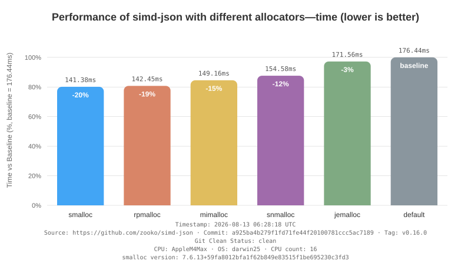
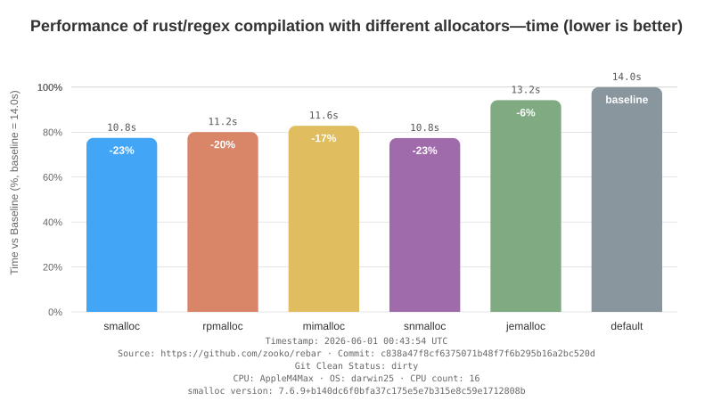
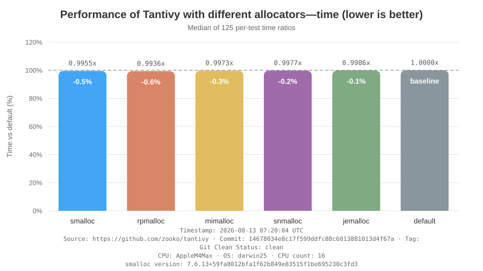
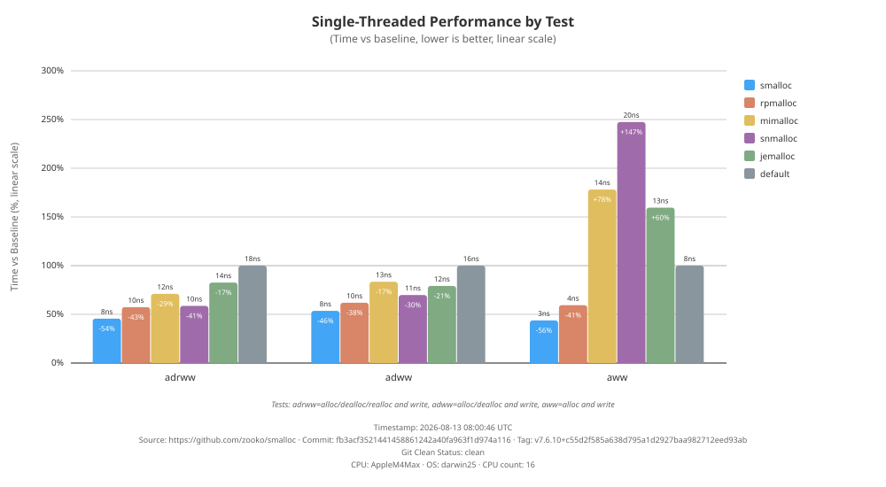
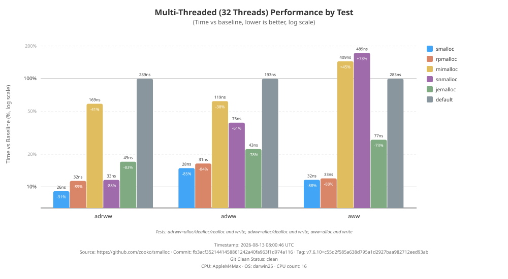
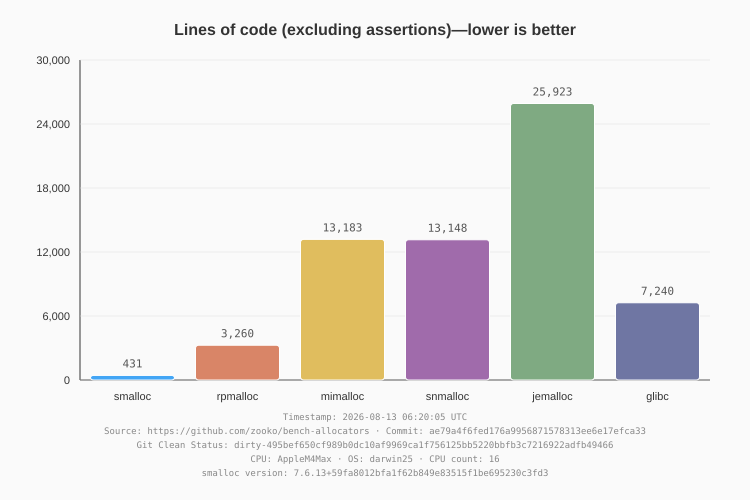

# Allocator Performance Benchmarks

This report compares memory allocator performance across different workloads.

## Allocators Tested

- **default**: the default Rust global allocator (falls through to system allocator)
- [jemalloc](https://github.com/jemalloc/jemalloc): using [tikv-jemallocator](https://github.com/tikv/jemallocator) Rust wrappers
- [snmalloc](https://github.com/microsoft/snmalloc): using [snmalloc-rs](https://github.com/SchrodingerZhu/snmalloc-rs) Rust wrappers
- [mimalloc](https://github.com/microsoft/mimalloc): using [mimalloc_rust](https://github.com/purpleprotocol/mimalloc_rust) Rust wrappers
- [rpmalloc](https://github.com/mjansson/rpmalloc): using [rpmalloc-rs](https://github.com/EmbarkStudios/rpmalloc-rs) Rust wrappers
- [smalloc](https://github.com/zooko/smalloc): a simple memory allocator (written in Rust)

## Workloads

- **simd-json**: High-performance JSON parser ([fork for benchmarking](https://github.com/zooko/simd-json))
- **rebar**: Regex engine benchmark harness ([fork for benchmarking](https://github.com/zooko/rebar))
- **tantivy**: Search engine ([fork for benchmarking](https://github.com/zooko/tantivy))
- **smalloc bench**: Micro-benchmarks for malloc/free/realloc operations
- **Lines of Code**: Implementation size comparison (excluding debug assertions)

**CPU:** AppleM4Max
**OS:** darwin25

---

## simd-json Results

[View detailed simd-json results](simd-json.result.txt)

---

## rebar Results

Cross-workload allocator pinning is disabled for rebar. Rebar's dependency
files are not inspected or managed by the outer benchmark script.

[View detailed rebar results](rebar.result.txt)

---

## tantivy Results

[View detailed tantivy results](tantivy.result.txt)

---

## smalloc Micro-Benchmarks

### Single-Threaded Performance

### Multi-Threaded Performance

[View detailed smalloc benchmark results](smalloc.result.txt)

---

## Lines of Code Comparison

[View detailed LOC results](locs.result.txt)

---

## Summary

- **simd-json** tests allocator performance during JSON parsing
- **rebar** tests allocator performance during regex compilation
- **tantivy** tests allocator performance in a search engine
- **smalloc bench** tests raw malloc/free/realloc performance in single and multi-threaded scenarios
- **Lines of Code** compares implementation size (excluding debug assertions)

### Methodology

- Each allocator is tested using identical workload code with only the global allocator changed
- Allocator dependencies are prepared and pinned across smalloc, simd-json, and tantivy
- Rebar is deliberately excluded from cross-workload allocator pinning
- Results show percentage differences from baseline (system allocator)
- Lower percentages = better performance (less time)

### How to Read the Performance Graphs

- **Baseline (default)**: The system allocator, shown at 100%
- **Negative percentages**: Faster than baseline (e.g., -3% means 3% faster)
- **Positive percentages**: Slower than baseline (e.g., +5% means 5% slower)
- **Bar height**: Proportional to execution time

---

Source: https://github.com/zooko/bench-allocators

**git source:** https://github.com/zooko/bench-allocators
**git commit:** ae79a4f6fed176a9956871578313ee6e17efca33
**git tag:** 
**git clean status:** dirty-495bef650cf989b0dc10af9969ca1f756125bb5220bbfb3c7216922adfb49466
**generated:** 2026-08-13 06:20:05 UTC
