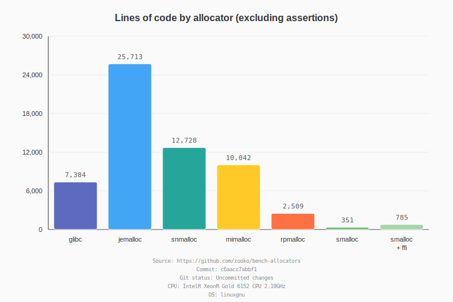
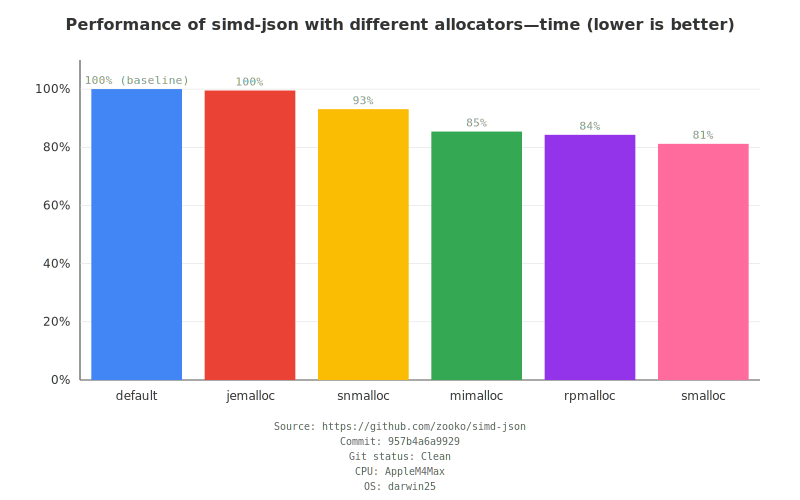
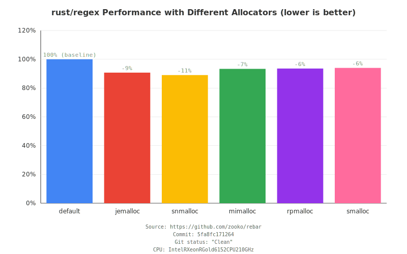

# Allocator Performance Benchmarks

This report compares memory allocator performance in different codebases.

Allocators:

- default: the default Rust global allocator, which in current Rust falls through to the system
  allocator
- [jemalloc](https://github.com/jemalloc/jemalloc): using
  [tikv-jemallocator](https://github.com/tikv/jemallocator) Rust wrappers
- [snmalloc](https://github.com/microsoft/snmalloc): using
  [snmalloc-rs](https://github.com/SchrodingerZhu/snmalloc-rs) Rust wrappers
- [mimalloc](https://github.com/microsoft/mimalloc): using
  [mimalloc_rust](https://github.com/purpleprotocol/mimalloc_rust) Rust wrappers
- [rpmalloc](https://github.com/mjansson/rpmalloc): using
  [rpmalloc-rs](https://github.com/EmbarkStudios/rpmalloc-rs) Rust wrappers
- [smalloc](https://github.com/zooko/smalloc): (written in Rust)

Count Lines-of-Code:

- the number of lines of source code (excluding debug assertions) in the allocator implementation

Work-loads:

- [simd-json](https://github.com/simd-lite/simd-json): High-performance JSON parser ([fork for
  benchmarking](https://github.com/zooko/simd-json))
- [rebar](https://github.com/BurntSushi/rebar): Regex engine benchmark harness ([fork for
  benchmarking](https://github.com/zooko/simd-json))

**CPU:** Apple M4 Max  
**OS:** darwin25  

---

## Lines of Code Comparison

### Code Size Graph

### Detailed Results

[View detailed LOC results](locs.result.txt)

---

## Summary

All three analyses show different aspects of allocator characteristics:

- **Lines of Code** compares implementation complexity (excluding debug assertions)
- **simd-json** tests memory allocation performance in JSON parsing workloads
- **rebar** tests memory allocation performance in regex compilation and matching  

---

## simd-json Results

### Performance Graph

### Detailed Results

[View detailed simd-json results](simd-json.result.txt)

---

## rebar Results

### Performance Graph

### Detailed Results

[View detailed rebar results](rebar.result.txt)

---

## Summary

Both benchmarks show allocator performance impact in real-world Rust applications:

- **simd-json** tests memory allocation patterns in JSON parsing workloads
- **rebar** tests memory allocation patterns in regex compilation and matching

### Methodology

- Each allocator is tested using identical code with only the global allocator changed
- Summary is the mean of normalized performance ratios across all tests
- Results show percentage differences from baseline (system allocator)
- Lower percentages = better performance (less time)

### How to Read the Performance Graphs

- **Baseline (default)**: The system allocator, shown at 100%
- **Negative percentages**: Faster than baseline (e.g., -3% means 3% faster)
- **Positive percentages**: Slower than baseline (e.g., +5% means 5% slower)
- **Bar height**: Directly proportional to execution time

---

Source: https://github.com/zooko/bench-allocators

**git commit:** 4c97366bbae1a9a941fc29375167f6f221f39568  
**git clean status:** Uncommitted changes  
**generated:** 2026-01-21 23:42:54 UTC  
