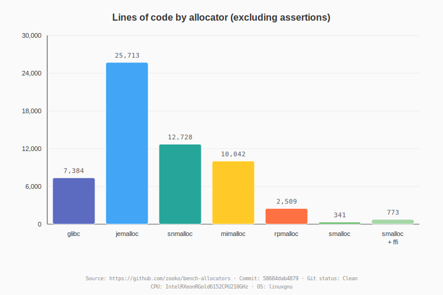
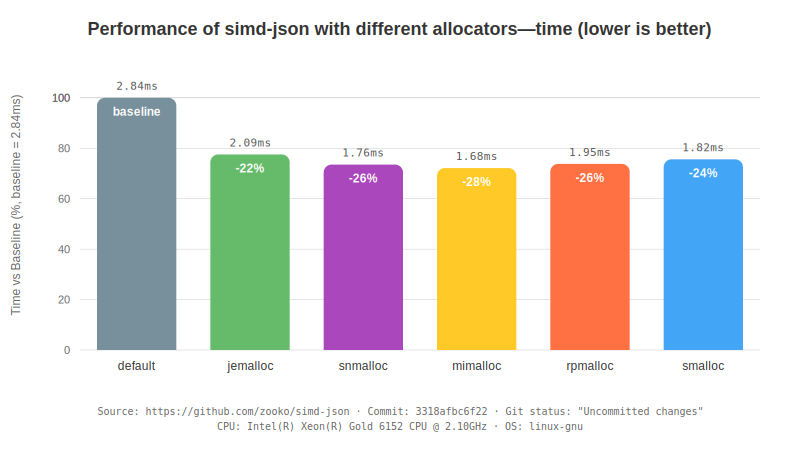
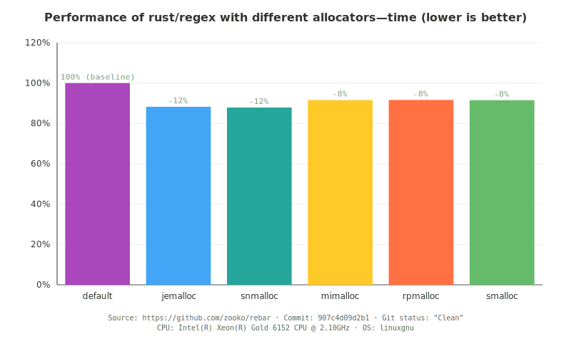
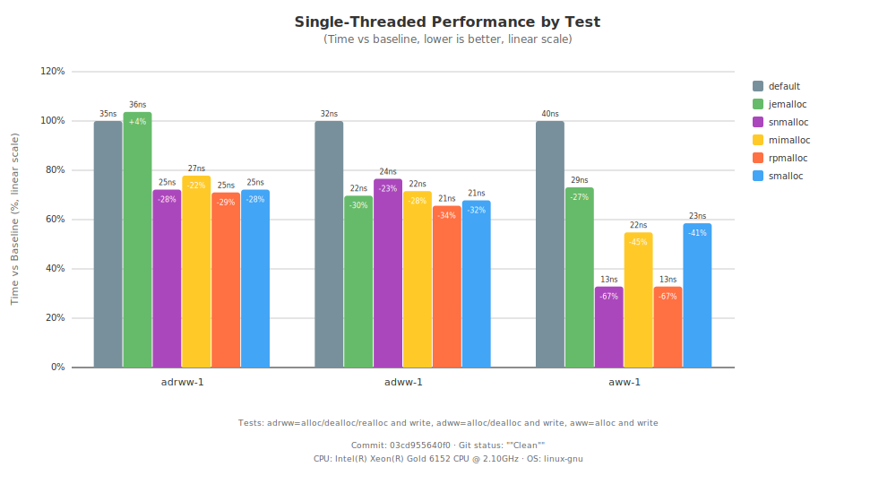
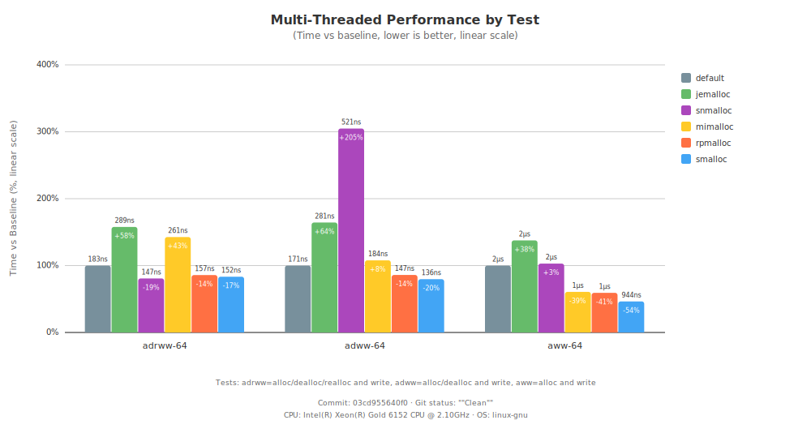

# Allocator Performance Benchmarks

This report compares memory allocator performance across different workloads.

## Allocators Tested

- **default**: the default Rust global allocator (falls through to system allocator)
- [jemalloc](https://github.com/jemalloc/jemalloc): using [tikv-jemallocator](https://github.com/tikv/jemallocator) Rust wrappers
- [snmalloc](https://github.com/microsoft/snmalloc): using [snmalloc-rs](https://github.com/SchrodingerZhu/snmalloc-rs) Rust wrappers
- [mimalloc](https://github.com/microsoft/mimalloc): using [mimalloc_rust](https://github.com/purpleprotocol/mimalloc_rust) Rust wrappers
- [rpmalloc](https://github.com/mjansson/rpmalloc): using [rpmalloc-rs](https://github.com/EmbarkStudios/rpmalloc-rs) Rust wrappers
- [smalloc](https://github.com/zooko/smalloc): a simple memory allocator (written in Rust)

## Workloads

- **Lines of Code**: Implementation size comparison (excluding debug assertions)
- **simd-json**: High-performance JSON parser ([fork for benchmarking](https://github.com/zooko/simd-json))
- **rebar**: Regex engine benchmark harness ([fork for benchmarking](https://github.com/zooko/rebar))
- **smalloc bench**: Micro-benchmarks for malloc/free/realloc operations

**CPU:** Intel(R) Xeon(R) Gold 6152 CPU @ 2.10GHz
**OS:** linux-gnu

---

## Lines of Code Comparison

[View detailed LOC results](locs.result.txt)

---

## simd-json Results

[View detailed simd-json results](simd-json.result.txt)

---

## rebar Results

[View detailed rebar results](rebar.result.txt)

---

## smalloc Micro-Benchmarks

### Single-Threaded Performance

### Multi-Threaded Performance

[View detailed smalloc benchmark results](smalloc.result.txt)

---

## Summary

- **Lines of Code** compares implementation size (excluding debug assertions)
- **simd-json** tests allocator performance during JSON parsing
- **rebar** tests allocator performance during regex compilation and matching
- **smalloc bench** tests raw malloc/free/realloc performance in single and multi-threaded scenarios

### Methodology

- Each allocator is tested using identical code with only the global allocator changed
- Results show percentage differences from baseline (system allocator)
- Lower percentages = better performance (less time)

### How to Read the Performance Graphs

- **Baseline (default)**: The system allocator, shown at 100%
- **Negative percentages**: Faster than baseline (e.g., -3% means 3% faster)
- **Positive percentages**: Slower than baseline (e.g., +5% means 5% slower)
- **Bar height**: Proportional to execution time

---

Source: https://github.com/zooko/bench-allocators

**git commit:** 9ebb0c24e13d369a9ba7bec0f95074230b1dbd81
**git clean status:** Clean
**generated:** 2026-01-25 01:03:32 UTC
